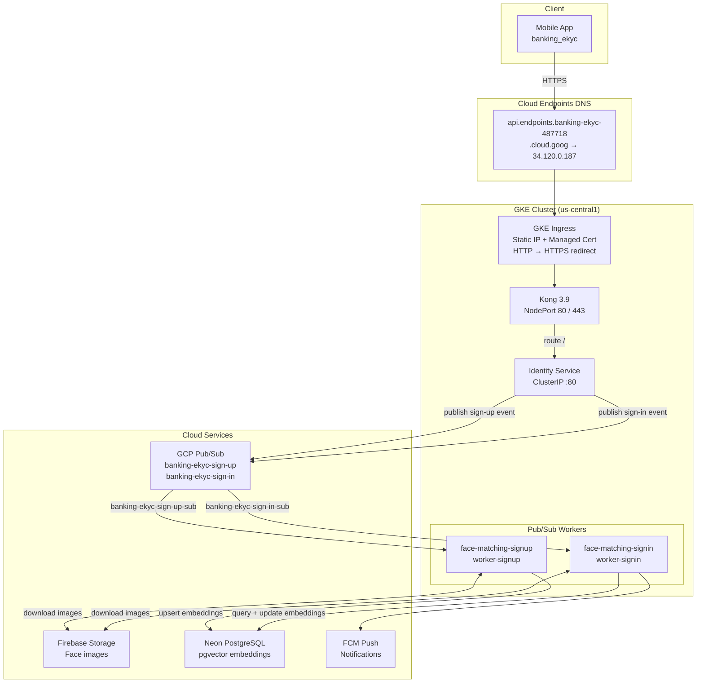

# GKE Banking eKYC

> Kubernetes deployment manifests for the **banking eKYC** platform on Google Kubernetes Engine — provisions a Kong API gateway, an identity microservice, and two face-matching Pub/Sub workers with automatic cost-based scaling and Google-managed HTTPS.

[](https://cloud.google.com/kubernetes-engine)
[](https://docs.konghq.com/)
[](https://cloud.google.com/endpoints)
[](https://firebase.google.com/)
[](https://neon.tech/)
[](https://www.tensorflow.org/)
[](https://cloud.google.com/artifact-registry)

---

## Table of contents

- [GKE Banking eKYC](#gke-banking-ekyc)
  - [Table of contents](#table-of-contents)
  - [Overview](#overview)
  - [Services](#services)
  - [Architecture](#architecture)
  - [Manifests](#manifests)
  - [Setup \& deploy](#setup--deploy)
    - [Prerequisites](#prerequisites)
    - [1. Reserve static IP \& configure DNS](#1-reserve-static-ip--configure-dns)
    - [2. Create secrets](#2-create-secrets)
    - [3. Configure Workload Identity](#3-configure-workload-identity)
    - [4. Apply manifests](#4-apply-manifests)
    - [5. Verify](#5-verify)
  - [Operational scripts](#operational-scripts)
  - [Project structure](#project-structure)

---

## Overview

This repository contains the raw Kubernetes YAML manifests that deploy the banking eKYC platform to GKE. It provisions four workloads — a Kong API gateway, an identity microservice, and two asynchronous face-matching Pub/Sub workers — behind a global HTTPS load balancer with a Google-managed TLS certificate and a Cloud Endpoints custom domain. A CronJob-based auto-scaler spins workloads down outside business hours to minimise infrastructure cost.

## Services

| Service | Kind | Description |
| :--- | :--- | :--- |
| **Kong API Gateway** | Deployment + NodePort | DB-less Kong 3.9 proxy; routes all traffic to the identity service; exposes HTTP on 8000 and HTTPS on 8443 |
| **Identity Service** | Deployment + ClusterIP | Core application; handles user registration, authentication, and eKYC; publishes sign-up and sign-in events to GCP Pub/Sub |
| **Face Matching — Sign-up** | Deployment (worker) | Pub/Sub subscriber; downloads reference images from Firebase Storage, extracts ArcFace embeddings, and persists them to Neon pgvector |
| **Face Matching — Sign-in** | Deployment (worker) | Pub/Sub subscriber; extracts login embeddings, compares them against stored references, and updates the per-user personalisation model |

## Architecture



## Manifests

| File | Kind | Purpose |
| :--- | :--- | :--- |
| `openapi.yaml` | Swagger 2.0 | Cloud Endpoints DNS — maps the custom domain to the static IP |
| `ingress.yaml` | Ingress | GKE global load balancer; routes to Kong; attaches the managed certificate |
| `managed-cert.yaml` | ManagedCertificate | Google-provisioned SSL/TLS for `api.endpoints.banking-ekyc-487718.cloud.goog` |
| `frontend-config.yaml` | FrontendConfig | Enforces HTTP → HTTPS redirect at the load-balancer level |
| `backend-config.yaml` | BackendConfig | Health-check config for Kong (`GET /health` every 10 s, port 8000) |
| `kong-configmap.yaml` | ConfigMap | Declarative Kong routing — proxies `/` to the identity service |
| `kong-deployment.yaml` | Deployment | Kong 3.9 in DB-less mode; mounts config from ConfigMap and TLS from secret |
| `kong-service.yaml` | Service (NodePort) | Exposes Kong to the GKE Ingress on ports 80 / 443 |
| `deployment.yaml` | Deployment | Identity service — core auth & eKYC application |
| `service.yaml` | Service (ClusterIP) | Internal cluster DNS for the identity service |
| `face-matching-signup-deployment.yaml` | Deployment | Sign-up Pub/Sub worker (no HTTP exposure) |
| `face-matching-signin-deployment.yaml` | Deployment | Sign-in Pub/Sub worker (no HTTP exposure) |
| `auto-scale-cronjob.yaml` | CronJob × 2 + RBAC | Scheduled scale-down at 23:00 ICT and scale-up at 07:00 ICT, Mon–Fri |

## Setup &amp; deploy

### Prerequisites

- **gcloud CLI** authenticated with project `banking-ekyc-487718`
- **kubectl** configured for `banking-ekyc-cluster` in `us-central1`
- **GKE cluster** with cluster autoscaler enabled (min nodes = 0) and Workload Identity enabled
- **Artifact Registry** repositories created for `identity-service` and `face-matching` images

### 1. Reserve static IP &amp; configure DNS

```bash
# Reserve a global static IP
gcloud compute addresses create kong-ingress-ip --global --project banking-ekyc-487718

# Confirm the allocated address (update openapi.yaml if different from 34.120.0.187)
gcloud compute addresses describe kong-ingress-ip --global --project banking-ekyc-487718

# Register the Cloud Endpoints DNS name
gcloud endpoints services deploy openapi.yaml --project banking-ekyc-487718
```

### 2. Create secrets

```bash
# Identity service
kubectl create secret generic identity-service-secrets \
  --from-file=config.yaml=path/to/identity-service/config.yaml \
  --from-file=firebase_credentials.json=path/to/firebase_credentials.json

# Face-matching workers
kubectl create secret generic face-matching-secrets \
  --from-file=config.yaml=path/to/face-matching/config.yaml \
  --from-file=firebase_credentials.json=path/to/firebase_credentials.json

# Kong TLS (self-signed or from your CA)
kubectl create secret tls kong-tls-secret \
  --cert=path/to/tls.crt \
  --key=path/to/tls.key
```

### 3. Configure Workload Identity

```bash
# Create a Kubernetes service account for the identity service
kubectl create serviceaccount identity-service-ksa

# Bind it to a GCP service account with Pub/Sub Publisher permissions
gcloud iam service-accounts add-iam-policy-binding \
  identity-service-sa@banking-ekyc-487718.iam.gserviceaccount.com \
  --role roles/iam.workloadIdentityUser \
  --member "serviceAccount:banking-ekyc-487718.svc.id.goog[default/identity-service-ksa]"
```

### 4. Apply manifests

```bash
# Network & ingress layer
kubectl apply -f managed-cert.yaml
kubectl apply -f frontend-config.yaml
kubectl apply -f backend-config.yaml
kubectl apply -f ingress.yaml

# Kong API gateway
kubectl apply -f kong-configmap.yaml
kubectl apply -f kong-deployment.yaml
kubectl apply -f kong-service.yaml

# Identity service
kubectl apply -f deployment.yaml
kubectl apply -f service.yaml

# Face-matching workers
kubectl apply -f face-matching-signup-deployment.yaml
kubectl apply -f face-matching-signin-deployment.yaml

# Auto-scaler
kubectl apply -f auto-scale-cronjob.yaml
```

> The managed certificate takes 15–60 minutes to transition from `Provisioning` to `Active`.

### 5. Verify

```bash
# Check all pods are running
kubectl get pods

# Check ingress and certificate status
kubectl describe ingress
kubectl describe managedcertificate kong-managed-cert

# Test the public endpoint
curl -I https://api.endpoints.banking-ekyc-487718.cloud.goog/health
```

## Operational scripts

| Script | Description |
| :--- | :--- |
| `scripts/scale-up.sh` | Restores all deployments to their saved replica counts (fallback: 1 each) |
| `scripts/scale-down.sh` | Saves current replica counts as annotations, then scales all deployments to 0 |
| `scripts/face-matching-start.sh` | Starts only the two face-matching workers |
| `scripts/face-matching-stop.sh` | Stops only the two face-matching workers |

```bash
# Scale everything down immediately (stops node billing within ~10 min)
./scripts/scale-down.sh

# Bring everything back up
./scripts/scale-up.sh

# Stop only face-matching workers while keeping the API live
./scripts/face-matching-stop.sh
./scripts/face-matching-start.sh
```

## Project structure

```text
gke_banking_ekyc/
├── openapi.yaml                              # Cloud Endpoints DNS definition
├── ingress.yaml                              # GKE Ingress (global LB, static IP)
├── managed-cert.yaml                         # Google Managed Certificate (SSL/TLS)
├── frontend-config.yaml                      # HTTP → HTTPS redirect policy
├── backend-config.yaml                       # Kong health-check configuration
├── kong-configmap.yaml                       # Declarative Kong routing config
├── kong-deployment.yaml                      # Kong 3.9 Deployment (DB-less mode)
├── kong-service.yaml                         # Kong NodePort Service (ports 80 / 443)
├── deployment.yaml                           # Identity Service Deployment
├── service.yaml                              # Identity Service ClusterIP
├── face-matching-signup-deployment.yaml      # Sign-up Pub/Sub worker Deployment
├── face-matching-signin-deployment.yaml      # Sign-in Pub/Sub worker Deployment
├── auto-scale-cronjob.yaml                   # RBAC + CronJobs for scheduled scaling
├── scripts/
│   ├── scale-up.sh                           # Restore all deployments
│   ├── scale-down.sh                         # Zero-out all deployments
│   ├── face-matching-start.sh                # Start face-matching workers only
│   └── face-matching-stop.sh                 # Stop face-matching workers only
└── INSTRUCTION.md                            # Deployment & architecture notes
```

---

Built with care by **Linh** • GCP project `banking-ekyc-487718`
